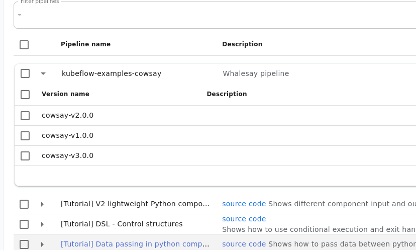

# kfp-releaser
`kfp-releaser` is a Kubernetes [controller] for [Kubeflow] pipeline deployments.
The release workflow needs a few components to effectively manage pipeline deployments
from git.

Since every deployment should be tracked, trigger and provisioned from version control
the controller was designed with GitOps in mind so a typical workflow would use the kfp [compiler] to create the
workflow (pipeline spec), [ytt](https://carvel.dev/ytt/) to render the `pipelineversions.kfp.jackhoman.com` manifest, git
to store the manifest and argo to release the manifest. Once the manifest reaches the cluster the controller
will handle syncing the pipelines with [Kubeflow].


## Simple Demo
### Install Argo
```shell
kubectl create namespace argocd
kubectl apply -n argocd -f https://raw.githubusercontent.com/argoproj/argo-cd/stable/manifests/install.yaml
```
Argo is used to install manifest files from the upstream GitHub repo holding the pipeline manifests. Each
pipeline version should be tracked in separate manifests so that all the Pipeline versions are always available on Kubeflow
(if that's what's desired -- if not they can be removed/updated)
e.g. 
### Install Kubeflow Pipelines
```shell
export PIPELINE_VERSION=1.7.0
kubectl apply -k "github.com/kubeflow/pipelines/manifests/kustomize/cluster-scoped-resources?ref=$PIPELINE_VERSION"
kubectl wait --for condition=established --timeout=60s crd/applications.app.k8s.io
kubectl apply -k "github.com/kubeflow/pipelines/manifests/kustomize/env/platform-agnostic-pns?ref=$PIPELINE_VERSION"
```

### Install `kfp-releaser`
```shell
kubectl create namespace kfp-releaser-system
kustomize build "github.com/johnhoman/kfp-releaser/config/crd?ref=main" | kubectl apply -f -
kustomize build "github.com/johnhoman/kfp-releaser/config/default?ref=main" | kubectl apply -f -
```

There are a few example manifests available in the examples/whalesay directory. You can
create the following argo application to install the pipelines

```shell
kubectl create namespace namespace kubeflow-examples
cat <<EOF | kubectl apply -f -
apiVersion: argoproj.io/v1alpha1                                                                                                                                                              
kind: Application                                                                                                                                                                             
metadata:                                                                                                                                                                                     
  name: whalesay                                                                                                                                                                              
  namespace: argocd                                                                                                                                                                           
spec:                                                                                                                                                                                         
  destination:                                                                                                                                                                                
    namespace: kubeflow-examples                                                                                                                                                              
    server: https://kubernetes.default.svc                                                                                                                                                    
  project: default                                                                                                                                                                            
  source:                                                                                                                                                                                     
    path: examples/whalesay
    repoURL: https://github.com/johnhoman/kfp-releaser
    targetRevision: HEAD                                                                                                                                                                      
    directory:
      recurse: true
EOF
application.argoproj.io/whalesay created
```

The `whalesay` pipeline and it's versions are now synced with kubeflow (notice the pipeline IDs)
```shell
➜  kfp-releaser git:(main) ✗ kubectl get pipelines --all-namespaces       
NAMESPACE           NAME     PIPELINEID
kubeflow-examples   cowsay   2d226a37-95ee-4431-9165-218b97f8ac2f
➜  kfp-releaser git:(main) ✗ kubectl get pipelineversions --all-namespaces
NAMESPACE           NAME            VERSION         PIPELINENAME   PIPELINEID
kubeflow-examples   cowsay-v1.0.0   cowsay-v1.0.0   cowsay         2d226a37-95ee-4431-9165-218b97f8ac2f
kubeflow-examples   cowsay-v2.0.0   cowsay-v2.0.0   cowsay         2d226a37-95ee-4431-9165-218b97f8ac2f
kubeflow-examples   cowsay-v3.0.0   cowsay-v3.0.0   cowsay         2d226a37-95ee-4431-9165-218b97f8ac2f
➜  kfp-releaser git:(main) ✗
```
### Pipelines Dashboard


### Create a RecurringRun

```shell
cat <<EOF | kubectl apply -f -
apiVersion: kfp.jackhoman.com/v1alpha1
kind: RecurringRun
metadata:
  name: cowsay-v1.0.0-every-minute
  namespace: kubeflow-examples
spec:
  versionRef: cowsay-v1.0.0
  schedule:
    cron: '* * * * *'
EOF
```


[Controller]: https://kubernetes.io/docs/concepts/architecture/controller
[Kubeflow]: https://kubeflow.org
[compiler]: https://kubeflow-pipelines.readthedocs.io/en/latest/source/kfp.compiler.html